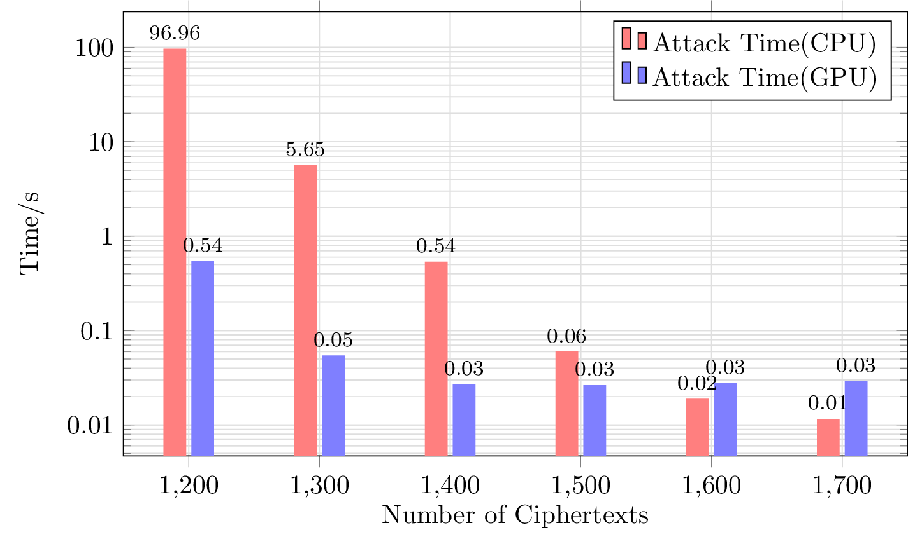
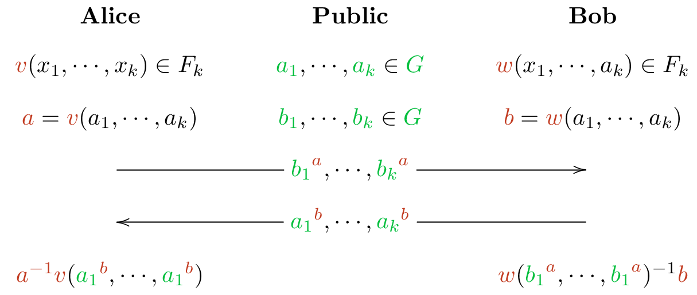
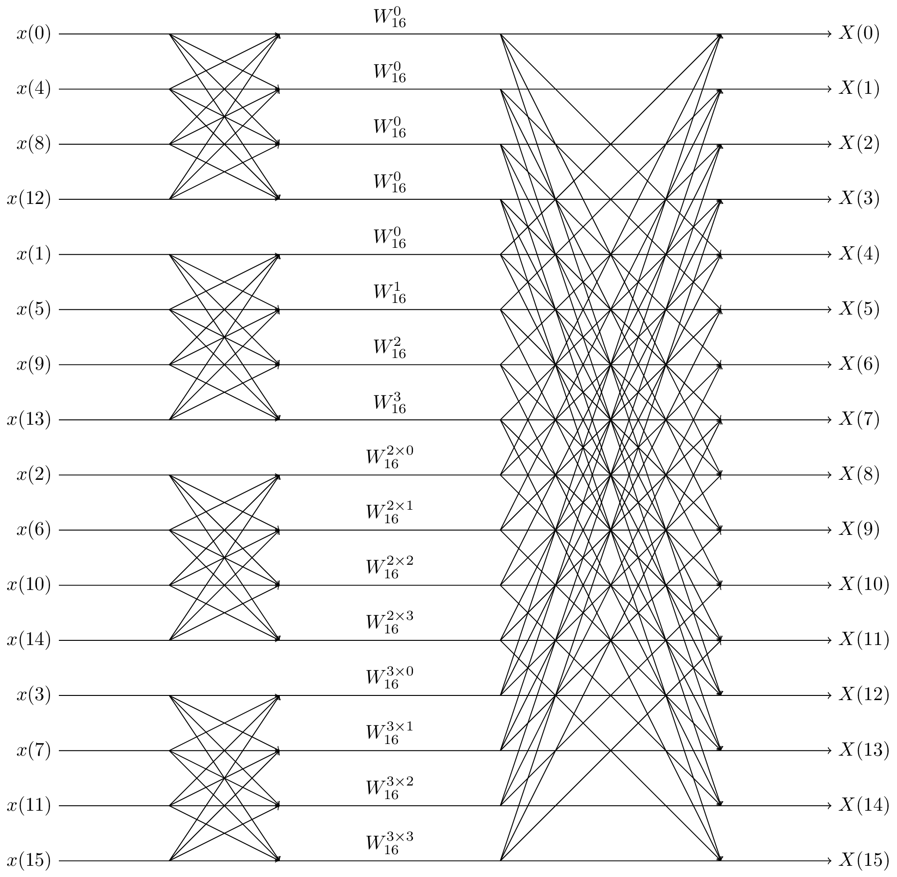

# My TikZ Samples

Write your lossless images with TikZ!

## Compile

Mostly, `pdflatex $TEXFILE` works.

## Gallery

- `bar.tex` is a bar chart.
  
- `commutator-ke.tex` describes the commutater key exchange protocol.
  
- `fft4.tex` is a radix-4 FFT signal flow diagram.
  
